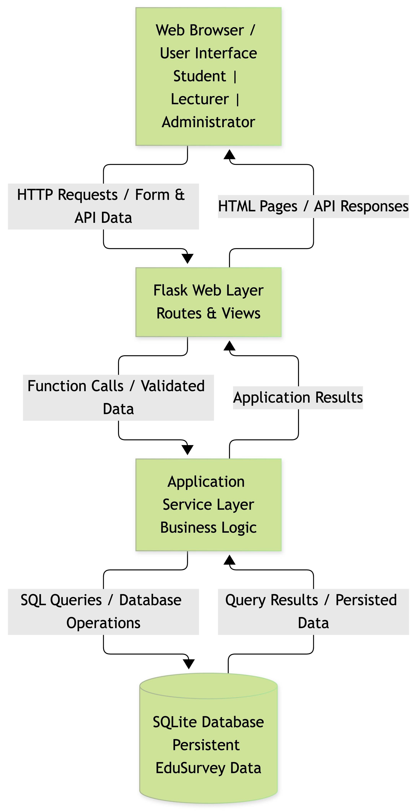

# EduSurvey Design

## 1. Architecture
EduSurvey uses a lightweight layered web architecture. The architecture separates the user interface, request handling, business logic, and data persistence so that each part of the system can be developed and tested independently.

The system consists of four main components:

1. **Web Browser / User Interface**
   - Provides the interface for Students, Lecturers, and Administrators.
   - Sends HTTP requests when users sign in, view evaluations, submit responses, manage evaluations, or review feedback.
   - Displays HTML pages and system responses returned by the backend.

2. **Flask Web Layer**
   - Handles HTTP routes and incoming requests.
   - Validates request data and forwards operations to the application service layer.
   - Returns rendered HTML pages or API responses to the browser.

3. **Application Service Layer**
   - Contains EduSurvey business logic.
   - Handles evaluation access, evaluation creation, submission rules, deadlines, and feedback retrieval.
   - Coordinates operations between the web layer and the database.

4. **SQLite Database**
   - Provides persistent storage for EduSurvey.
   - Stores users, courses, course enrolments, evaluations, questions, responses, and answers.
   - Is accessed through SQL queries from the application service layer.

### Component Communication

- **Browser → Flask Web Layer:** HTTP requests and form/API data.
- **Flask Web Layer → Application Service Layer:** function calls and validated application data.
- **Application Service Layer → SQLite Database:** SQL queries and database operations.
- **SQLite Database → Application Service Layer:** query results and persisted data.
- **Flask Web Layer → Browser:** rendered HTML pages or API responses.

This architecture supports the Milestone 2 walking skeleton by providing a complete path from the browser to the backend, through the application logic, to a real SQLite database, and back to the browser.

## 2. Data Model

## 3. API Design
EduSurvey provides REST-style API endpoints for authentication, course evaluations, student submissions, and lecturer feedback. The API supports the core P0 user stories defined in the requirements.

| Method | Endpoint | Actor | Purpose | Input | Success | Errors |
|---|---|---|---|---|---|---|
| POST | `/api/auth/login` | All users | Sign in to EduSurvey | `email`, `password` | `200 OK` with authenticated user/session | `400 Bad Request`, `401 Unauthorized` |
| POST | `/api/auth/logout` | Authenticated user | Sign out and invalidate the current session | Current session | `200 OK` | `401 Unauthorized` |
| GET | `/api/evaluations` | Student | View evaluations assigned to the student | Current user/session | `200 OK` with evaluation list | `401 Unauthorized`, `403 Forbidden` |
| GET | `/api/evaluations/{id}` | Student | View an evaluation and its questions | Evaluation ID | `200 OK` with evaluation details | `403 Forbidden`, `404 Not Found` |
| POST | `/api/evaluations/{id}/responses` | Student | Submit a completed course evaluation | Answers to evaluation questions | `201 Created` | `400 Bad Request`, `409 Conflict`, `422 Unprocessable Entity` |
| POST | `/api/evaluations` | Lecturer / Administrator | Create a course evaluation | Course, title, deadline, questions | `201 Created` | `400 Bad Request`, `403 Forbidden` |
| GET | `/api/lecturer/courses/{courseId}/feedback` | Lecturer | View feedback for an assigned course | Course ID | `200 OK` with feedback data | `403 Forbidden`, `404 Not Found` |
| GET | `/api/evaluations/{id}/statistics` | Lecturer | View evaluation feedback statistics | Evaluation ID | `200 OK` with statistics | `403 Forbidden`, `404 Not Found` |

### API Rules

- Authentication is required for all endpoints except `/api/auth/login`.
- Students may only access evaluations assigned to courses in which they are enrolled.
- A student may submit an evaluation only once. A duplicate submission returns `409 Conflict`.
- An evaluation cannot be submitted after its deadline.
- Lecturers may create evaluations only for courses assigned to them.
- Lecturers may access feedback and statistics only for their assigned courses.
- Administrators may create and manage evaluations at the system level.
- Invalid or missing request data returns an appropriate `400` or `422` response.
- Requests for resources that do not exist return `404 Not Found`.
- Unauthorized role or course access returns `403 Forbidden`.

### Response-Time Requirement

Under normal operating conditions, key user interactions including sign in, evaluation submission, and feedback/statistics retrieval should return a system response within **3 seconds**, consistent with the Milestone 1 requirements.
## 4. Walking Skeleton

## 5. Design Decisions

## 6. What Changed Since M1