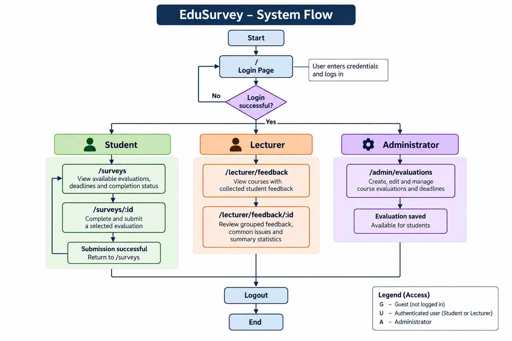

# EduSurvey Requirements Document

## 1. Product Vision

EduSurvey is an online course evaluation platform for students, lecturers, and university administrators that centralizes the collection, management, and analysis of student feedback, replacing time-consuming paper-based surveys and manual data processing with a more efficient and accessible digital system.

---

# 2. Personas

### Persona 1 – Student

**Name:** Minh – Third-year AI student

**Role:** A third-year university student studying Artificial Intelligence who completes course evaluation surveys during the semester.

**Goal:** Minh wants to complete course evaluations quickly and efficiently, with clear reminders before the submission deadline.

**Blocked by:** Minh often forgets survey deadlines and finds long surveys tiring and time-consuming, especially when the questions are repetitive or not focused on the most important aspects of the course.

**In his words:** *"I often forget the deadline, and the surveys are too long. I want reminders and questions that are short and focused."*

**Technical skill:** Comfortable using smartphones, laptops, and web applications. Minh expects the survey system to be simple, responsive, and easy to use on mobile devices.

**Interview note:** Interviewed an anonymous third-year Artificial Intelligence student on **18 September 2026**. The student identified forgotten deadlines and overly long surveys as the main problems, and preferred deadline reminders and shorter, more focused survey questions.

---

### Persona 2 – Lecturer

**Name:** Anh – University Lecturer

**Role:** A university lecturer who reviews student course evaluations to understand teaching effectiveness and identify areas for improvement.

**Goal:** Anh wants to understand student feedback quickly, identify the most common issues, and use clear statistics to decide which aspects of the course should be improved.

**Blocked by:** Student feedback is often too general, making it difficult to determine which problems are the most important. When there are many responses, manually reading and comparing individual comments also makes it difficult to identify recurring themes.

**In his words:** *"The feedback is often too general, so it is difficult to know which issues are actually important. I want the system to group feedback by topic, highlight the most common issues, and show useful statistics."*

**Technical skill:** Comfortable using university systems, web applications, and basic data dashboards. Anh prefers information to be summarized clearly rather than manually reviewing a large number of individual responses.

**Interview note:** Interviewed a university lecturer on **18 September 2026**. The lecturer identified overly general feedback and difficulty prioritizing issues as the main problems. The lecturer preferred a system that automatically groups feedback by topic, highlights frequently mentioned issues, and provides summary statistics.

# 3. Scenarios

## Scenario 1: Student completes a course evaluation before the deadline

**Persona:** Minh – Third-year AI student

**Goal:** Complete a course evaluation quickly before the deadline and provide useful feedback about the learning experience.

**Steps:**

1. Minh receives a reminder that a course evaluation is due within the next 24 hours.
2. He checks the evaluations that he still needs to complete and sees the deadline for each one.
3. He chooses the evaluation for one of his current courses.
4. He reads a short set of focused questions about the course content, teaching quality, and overall learning experience.
5. He provides ratings and adds a short comment about the parts of the course that were helpful and the areas that could be improved.
6. Before submitting, he notices that one required question has not been answered and completes the missing response.
7. He submits the evaluation and receives confirmation that his feedback has been recorded successfully.
8. The completed evaluation is marked as finished so that Minh knows he does not need to complete it again.

## Scenario 2: Lecturer reviews and prioritizes student feedback

**Persona:** Anh – University Lecturer

**Goal:** Understand the most important issues raised by students and use summarized feedback to improve the course.

**Steps:**

1. Anh reviews the latest feedback collected for one of his courses after the evaluation period has closed.
2. He sees an overview showing how many students submitted evaluations and the overall rating results.
3. He examines feedback that has been automatically grouped into common topics such as course content, teaching delivery, workload, and assessment.
4. He compares the number of comments in each topic to identify which issues are mentioned most frequently.
5. He notices that workload is one of the most frequently mentioned concerns and reviews the related student comments for more detail.
6. He checks the summary statistics to compare ratings across different areas of the course.
7. He identifies the main issues that need attention and records the areas he plans to improve for the next teaching period.
8. He finishes the review with a clear understanding of the most common student concerns without having to manually read every response individually.

---

# 4. User Stories

| ID | User Story | Priority | Story Points |
|---|---|---|---|
| US01 | As a registered user, I want to log into EduSurvey securely so that I can access the functions available to my role. | P0 | 3 |
| US02 | As a student, I want to view my available course evaluations and their deadlines so that I know which surveys I still need to complete before they close. | P0 | 3 |
| US03 | As a student, I want to complete and submit a course evaluation so that I can provide feedback about the course and lecturer. | P0 | 5 |
| US04 | As a lecturer, I want to review submitted student feedback for my courses so that I can identify common concerns and improve my teaching. | P0 | 5 |
| US05 | As a lecturer, I want student feedback to be grouped by topic so that I can quickly identify recurring areas of concern. | P1 | 5 |
| US06 | As a lecturer, I want the system to highlight the most frequently mentioned issues in student feedback so that I can focus on the areas that need the most attention. | P1 | 5 |
| US07 | As a lecturer, I want to view summary statistics for student evaluations so that I can understand overall course performance without reading every response individually. | P1 | 5 |
| US08 | As an administrator, I want to create a course evaluation with a title, deadline, and questions so that students can provide structured feedback for a course. | P1 | 5 |
| US09 | As an administrator, I want to set and update evaluation deadlines so that students know when each course evaluation is available and when it closes. | P1 | 3 |
| US10 | As a student, I want to receive a reminder before a course evaluation deadline so that I do not forget to complete the survey on time. | P1 | 3 |

## US01 - User Login and Authentication

**Acceptance Criteria**

* **Given** a registered user enters a valid email address and password, **When** the user submits the login request, **Then** the system authenticates the account and grants access within **3 seconds**.

* **Given** a user enters an incorrect email address or password, **When** the user attempts to log in, **Then** the system rejects the request and displays the exact message **"Invalid email or password."**

* **Given** a user successfully logs in, **When** the system identifies the account role, **Then** the user is assigned exactly **1 of 3 supported roles: Student, Lecturer, or Administrator**, and can access only the functions permitted for that role.

## US02 - View Available Surveys

**Acceptance Criteria**

* **Given** a student has exactly **3 active course evaluations** assigned, **When** the student views the available surveys, **Then** the system displays exactly **3 active surveys**.

* **Given** a survey is available to the student, **When** its information is displayed, **Then** the system shows exactly **5 details**: survey title, course name, lecturer name, deadline, and status.

* **Given** an unfinished survey has less than **24 hours** remaining before its deadline, **When** the student views the survey list, **Then** the system displays the exact status **"Due soon"** for that survey.

* **Given** the student has already submitted an evaluation, **When** the student views the survey list, **Then** that survey displays the exact status **"Completed"** and cannot be submitted again.

## US03 - Complete Course Evaluation

**Acceptance Criteria**

* **Given** a student selects an active course evaluation, **When** the evaluation is opened, **Then** the system displays all questions assigned to that evaluation, including all required questions.

* **Given** an evaluation contains exactly **5 required questions** and the student has answered all **5**, **When** the student submits the evaluation, **Then** the system stores exactly **1 completed response** and changes the survey status to **"Completed"**.

* **Given** an evaluation contains **5 required questions** but the student answers only **4**, **When** the student attempts to submit, **Then** the system rejects the submission and displays the exact message **"Please answer all required questions before submitting."**

* **Given** the student has already submitted the evaluation once, **When** the student attempts to submit the same evaluation again, **Then** the system rejects the second submission and displays the exact message **"You have already completed this evaluation."**

## US04 - Review Submitted Feedback

**Acceptance Criteria**

* **Given** a course evaluation has received student responses, **When** the lecturer reviews the feedback, **Then** the system displays the submitted ratings and comments for that course.

* **Given** a course has received exactly **20 completed evaluations**, **When** the lecturer views the feedback summary, **Then** the system displays the response count as exactly **20**.

* **Given** a lecturer attempts to review feedback for a course they do not teach, **When** the request is made, **Then** the system denies access and displays the exact message **"You do not have permission to view this course feedback."**

## US05 - Group Feedback by Topic

**Acceptance Criteria**

* **Given** a course has received written student feedback, **When** the lecturer reviews the feedback analysis, **Then** the system groups related comments into meaningful topics.

* **Given** the feedback contains comments related to exactly **4 topics: course content, teaching delivery, workload, and assessment**, **When** the analysis is generated, **Then** the system displays exactly **4 topic groups**.

* **Given** a feedback comment cannot be confidently assigned to an existing topic, **When** the system processes the comment, **Then** it places the comment in the exact category **"Other"** instead of discarding it.

## US06 - Highlight Common Issues

**Acceptance Criteria**

* **Given** student feedback has been grouped into topics, **When** the lecturer views the feedback analysis, **Then** the system ranks the topics by how frequently they are mentioned.

* **Given** workload is mentioned in **12 comments**, assessment in **8 comments**, and course content in **5 comments**, **When** the system displays the issue summary, **Then** workload appears as the most frequently mentioned issue with a count of **12**.

* **Given** two topics have the same number of mentions, **When** the system ranks the issues, **Then** both topics display the same frequency count rather than incorrectly assigning one a higher count.

## US07 - View Feedback Statistics

**Acceptance Criteria**

* **Given** a course evaluation has completed responses, **When** the lecturer views the statistical summary, **Then** the system displays the total number of responses and the average rating for each rating-based question.

* **Given** a rating question receives the values **4, 5, 3, 4, and 4**, **When** the system calculates the average, **Then** it displays the average rating as exactly **4.0 out of 5.0**.

* **Given** a course evaluation has received **0 responses**, **When** the lecturer views the statistical summary, **Then** the system displays the exact message **"No responses available for this evaluation."**

## US08 - Create Course Evaluation

**Acceptance Criteria**

* **Given** an administrator provides a course, evaluation title, deadline, and at least one question, **When** the evaluation is created, **Then** the system saves it and makes it available for the assigned course.

* **Given** an administrator creates an evaluation with exactly **5 questions**, **When** the evaluation is saved successfully, **Then** the system stores and displays exactly **5 questions** for that evaluation.

* **Given** an administrator attempts to create an evaluation without a deadline, **When** the creation request is submitted, **Then** the system rejects the request and displays the exact message **"A deadline is required."**

## US09 - Manage Evaluation Deadline

**Acceptance Criteria**

* **Given** an administrator sets a valid future deadline for an evaluation, **When** the deadline is saved, **Then** the updated deadline is displayed to students assigned to that evaluation.

* **Given** an evaluation deadline is set to **23:59 on 30 September 2026**, **When** the current time passes **23:59 on 30 September 2026**, **Then** the evaluation status changes to **"Closed"** and students can no longer submit responses.

* **Given** an administrator attempts to set a deadline earlier than the current date and time, **When** the update is submitted, **Then** the system rejects the change and displays the exact message **"Deadline must be in the future."**

## US10 - Send Deadline Reminder

**Acceptance Criteria**

* **Given** a student has an unfinished evaluation with an upcoming deadline, **When** the deadline is approaching, **Then** the system sends a reminder to the student.

* **Given** an unfinished evaluation has exactly **24 hours** remaining before its deadline, **When** the reminder condition is reached, **Then** the system sends exactly **1 reminder** containing the course name and deadline.

* **Given** a student has already completed an evaluation, **When** the reminder process runs, **Then** the system does not send a reminder for that completed evaluation.

# 5. Business Rules

### BR1 – One Submission per Evaluation

**Rule:** A student may submit each course evaluation only once.

**Worked example:** If Minh submits the evaluation for course AI301 at **14:30 on 20 September 2026**, a second submission attempt for the same evaluation at **14:35** is rejected and the original submission remains unchanged.

### BR2 – Evaluation Deadline Enforcement

**Rule:** Students may submit an evaluation only before its configured deadline. Once the deadline has passed, the evaluation must be closed automatically and no new responses may be accepted.

**Worked example:** If the AI301 evaluation deadline is **23:59 on 30 September 2026**, a submission at **23:58** is accepted, while a submission at **00:01 on 1 October 2026** is rejected because the evaluation is closed.

---

### BR3 – Required Questions Must Be Completed

**Rule:** A student must answer all questions marked as required before an evaluation can be submitted.

**Worked example:** If an evaluation contains **5 required questions** and Minh answers only **4**, the submission is rejected. After he answers all **5 questions**, the evaluation can be submitted successfully.

---

### BR4 – Role-Based Access Control

**Rule:** Each authenticated account must have exactly one system role, and users may access only the functions permitted for that role.

**Worked example:** EduSurvey supports **3 roles: Student, Lecturer, and Administrator**. A Student may complete evaluations but cannot create them; a Lecturer may review feedback for their courses but cannot create administrator-managed evaluations; an Administrator may create and manage evaluations.

---

### BR5 – Rating Scale

**Rule:** All rating-based evaluation questions must use a fixed scale from **1 to 5**, where 1 is the lowest rating and 5 is the highest rating.

**Worked example:** If five students give a question the ratings **4, 5, 3, 4, and 4**, the valid average displayed by the system is **4.0 out of 5.0**. A rating of **6** is invalid and must not be accepted.

---

### BR6 – Deadline Reminder Rule

**Rule:** The system sends one deadline reminder for an unfinished evaluation exactly **24 hours before the deadline**. No reminder is sent if the evaluation has already been completed.

**Worked example:** If an evaluation closes at **18:00 on 25 September 2026**, a student who has not completed it receives exactly **1 reminder at 18:00 on 24 September 2026**. A student who submitted the evaluation at **15:00 on 24 September 2026** receives no reminder.

## 6. Screens and Flow

| Route                    | Purpose                                                                     | Access | Priority |
| ------------------------ | --------------------------------------------------------------------------- | ------ | -------- |
| `/`                      | Landing page and user login                                                 | G      | P0       |
| `/surveys`               | View available course evaluations, deadlines, and completion status         | U      | P0       |
| `/surveys/:id`           | Complete and submit a selected course evaluation                            | U      | P0       |
| `/lecturer/feedback`     | View courses with collected student feedback                                | U      | P0       |
| `/lecturer/feedback/:id` | Review grouped feedback, common issues, and summary statistics for a course | U      | P1       |
| `/admin/evaluations`     | Create, edit, and manage course evaluations and deadlines                   | A      | P1       |

**Access legend**

* **G** – Guest
* **U** – Authenticated user. Access to Student or Lecturer functions depends on the user's assigned role.
* **A** – Administrator

### System Flow

The flow begins at the login page. After authentication, users are directed to functions permitted for their assigned role. Students can view and complete evaluations, lecturers can review feedback and statistics for their courses, and administrators can create and manage course evaluations.
